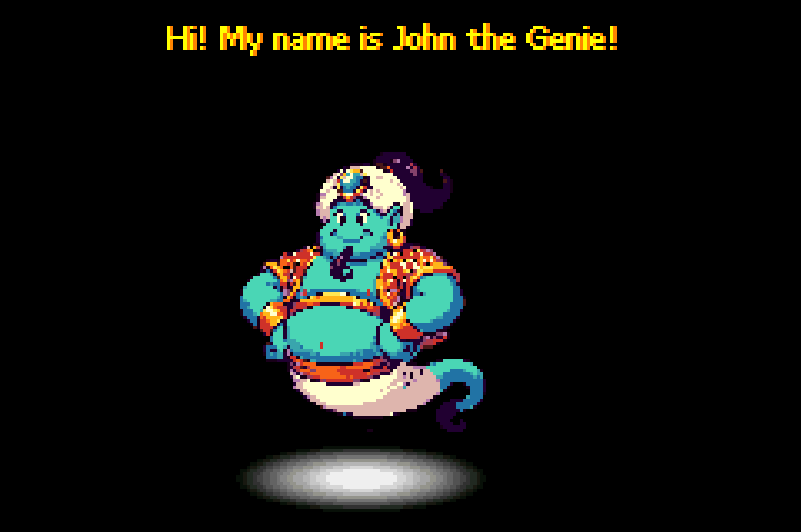
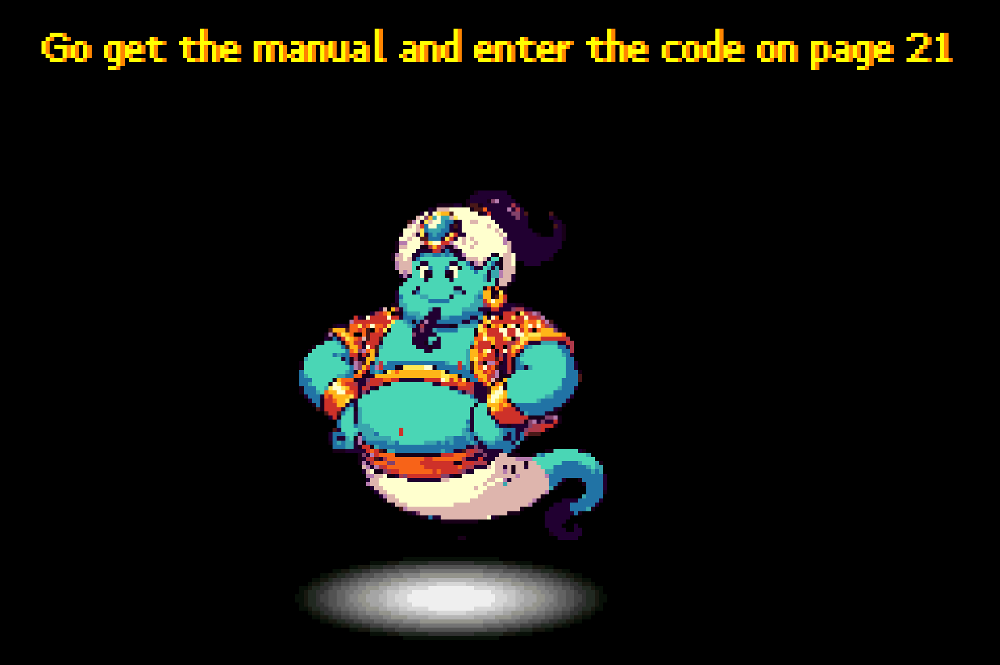
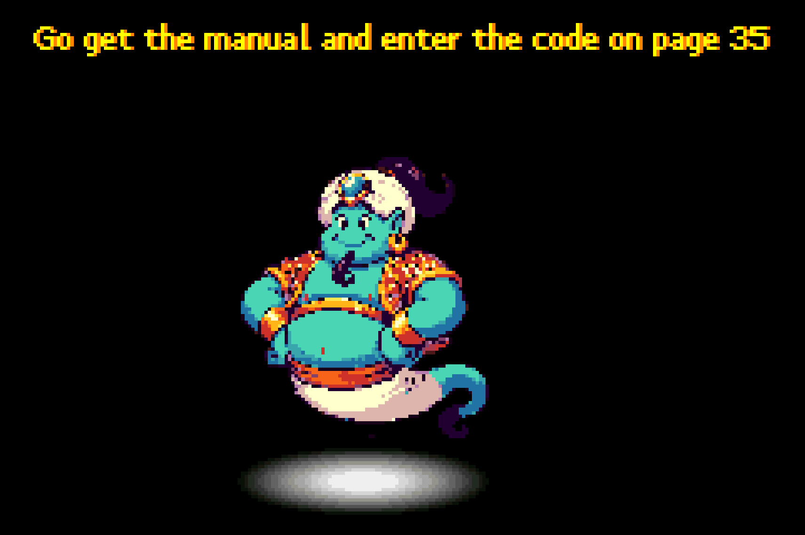
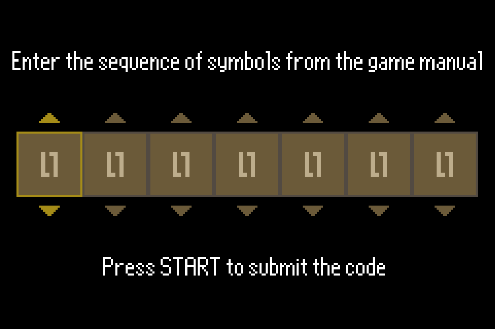
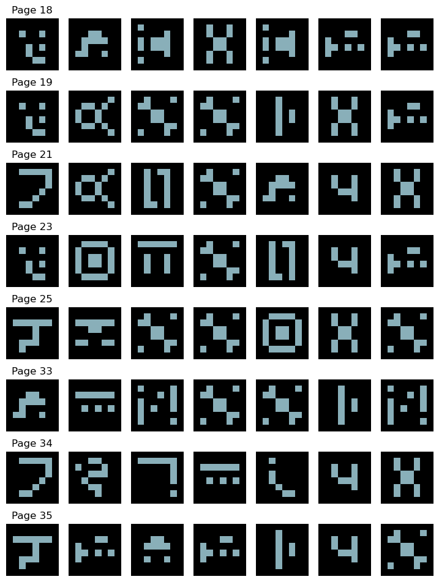
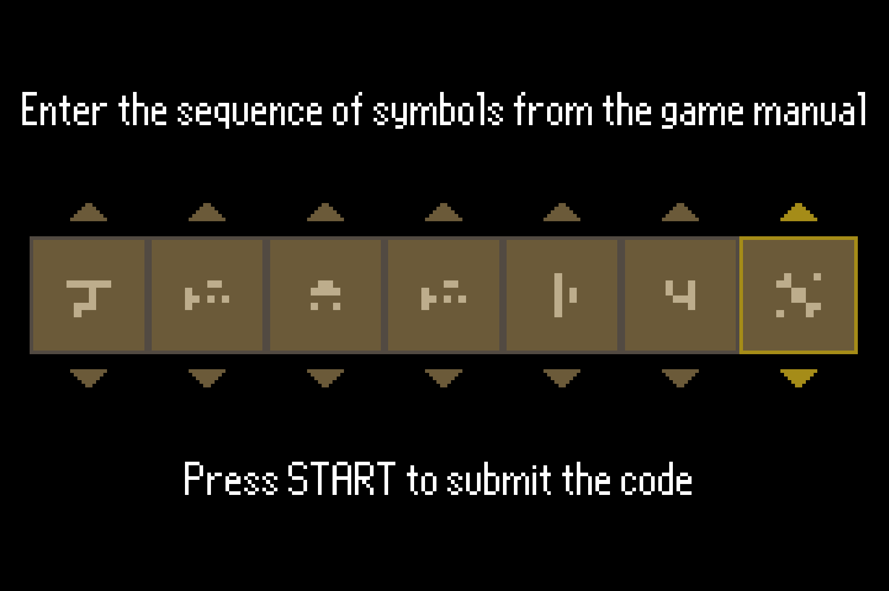
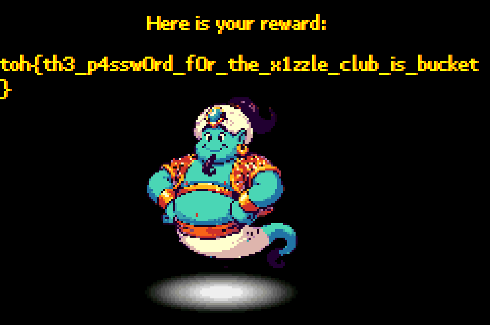

# Retro Mania
Original Writeup by Frank01001


> Hey guys. So, I was digging around in my basement and found this super old GBA game from when I was a kid. Total nostalgia trip. BUT, here's the problem: I can’t find the manual, and it had the instructions for the anti-piracy check. 😭 Tried to fire it up on my GBA, but it ain't budging. Anyone know how to get past this? I’ve got the ROM file here if anyone wants to take a look. Help an old gamer out!

## Description
You are presented with a GBA ROM file that includes an anti-piracy check. Solve the sequence checker to retrieve the flag. Basically, it is a traditional crackme challenge.

## Analysis
Let's load the ROM into an emulator (like mGBA) to see what happens.

Upon launching the game, we're greeted with a title screen, telling us to press Start to begin. This is not just a nostalgic trip; it also sets the stage for the anti-piracy check that follows. The game saves the index of the frame where the player pressed Start, which will be used for "randomization" later.


After pressing start, we meet John the Genie, a friendly character who asks us for proof that we own the game.



He prompts us to open a page from the game manual, which contains a unique symbolic code. As I mentioned before, the requested page is "randomized" based on the frame index where we pressed Start. In fact, when running the game multiple times, it is highly likely that the page number will change each time.




The following is the code snippet that handles the "randomization" of the page number:

```c
unsigned int pageIndex = num_frames_start_press % 8;
unsigned int randomizedPage = possible_pages[pageIndex];
char randomizedPageStr[3];
sprintf(randomizedPageStr, "%d", randomizedPage);

tte_erase_line();

tte_set_pos(10, 5);
tte_write("Go get the manual and enter the code on page ");
tte_write(randomizedPageStr);
```

In total, there are 8 possible pages that the game can request.

```c
const unsigned int possible_pages[] = {18,19,21,23,25,33,34,35};
```

After John's greeting, the game presents you with a selector to enter the sequence of 7 symbols from the manual page. The selector is a simple interface where you can choose the symbols one by one. You interact with the ↑ and ↓ buttons to navigate through the symbols, and the Start button to confirm the code.



From an inspection of sprites contained in the ROM (or from exploring the game directly), we can see that the number of symbols is 26. So...is bruteforcing an option? Well, not quite.


For reference, these are the indices of each symbol, which will come in handy later:


You would have to guess 26^7 combinations, which is a whopping 8031810176 attempts ≈ 33 bits of entropy. You clearly can't do that from the emulator alone, since it would take a lifetime to try all possible combinations. Even if you attempted a brute-force approach, you would first need to identify the flag-checking logic in the ROM and run it multiple times, by which point you would likely have already discovered the logic behind the anti-piracy check.

## Solution
There are many ways to avoid having to reverse the whole ROM. The first is to look around the code for interesting functions. The other is to use the debugger included in most GBA emulators, such as mGBA. I find mGBA particularly handy, since it exposes a GDBServer to which you can connect. If you are used to tools like pwndbg or gef, you will feel right at home.

We need to identify two functions: a utility of the sequence checker and the sequence checker itself. The following is the sorce code for both:

```c
char parityCheck(unsigned char block)
{
    unsigned char parity = 0;
    for(int i = 0; i < 8; i++)
    {
        parity ^= block & 1;
        block >>= 1;
    }
    return parity;
}

bool isLicenceCorrect(const unsigned char* licence, const unsigned char pageNumber)
{
    if(licence[6] > 0b11111 || licence[5] > 0b11111 || licence[4] > 0b11111 || licence[3] > 0b11111 || licence[2] > 0b11111 || licence[1] > 0b11111 || licence[0] > 0b11111)
        return false;

    // Modular multiplication check
    unsigned int numberOne = (licence[6] & 0b10000) >> 4 | licence[2] << 1 | licence[1] << 6 | licence[0] << 11;
    unsigned int numberTwo = (licence[6] & 0b00001) | licence[5] << 1 | licence[4] << 6 | licence[3] << 11;

    unsigned int firstCheck = ((numberOne * numberTwo)) % 0xabc;

    if(firstCheck != 1)
        return false;

    // Parity check
    unsigned char totalParityGroup1 = parityCheck(licence[0]) ^ parityCheck(licence[2]) ^ parityCheck(licence[4]);
    unsigned char totalParityGroup2 = parityCheck(licence[1]) ^ parityCheck(licence[3]) ^ parityCheck(licence[5]);

    unsigned char flipBit = (licence[6] & 0b01000) >> 3;
    unsigned char correctParity1 = ((licence[6] & 0b00010) >> 1) ^ flipBit;
    unsigned char correctParity2 = ((licence[6] & 0b00100) >> 2) ^ flipBit;

    if(totalParityGroup1 != correctParity1 || totalParityGroup2 != correctParity2)
        return false;

    // Other arithmetic checks
    if(((licence[0] & licence[2]) != (licence[3] ^ 0x11)) || ((licence[2] & licence[4]) != (licence[5] ^ 0x12)))
        return false;

    if((licence[0] ^ licence[6]) != 0b11111)
        return false;

    // Page check
    if((unsigned int) licence[0] + (unsigned int) licence[1] != pageNumber)
        return false;

    return true;
}
```

The checks themself are not too complicated, but depending on how you approach the reversing task, they may be difficult to spot. The first function, `parityCheck`, calculates the parity of a byte, which is used later in the sequence checker. The second function, `isLicenceCorrect`, performs several checks on the input sequence to verify its validity. For each page number, the function has only one solution, meaning we can use solvers like [z3](https://ericpony.github.io/z3py-tutorial/guide-examples.htm) to find the correct sequence for each page.

```py
import z3
import math
import sys

def pad_zeros(binary_string, desired_length):
    return '0' * (desired_length - len(binary_string)) + binary_string

argc = len(sys.argv)
argv = sys.argv

if argc != 2:
    print(f'Usage: {argv[0]} <page_number>')
    sys.exit(1)

try:
    chosen_page = int(argv[1])
except ValueError:
    print(f'Invalid page number: {argv[1]}')
    sys.exit(1)

def compute_parity(bitvec):
    parity = 0
    for i in range(bitvec.size()):
        parity = parity ^ z3.Extract(i, i, bitvec)
    return parity

p = z3.BitVecVal(0xabc, 32)

input = [z3.BitVec(f'x_{i}', 5) for i in range(7)]

# Solve for the seed given random_long = user_input
s = z3.Solver()

for i in range(7):
    s.add(z3.UGE(input[i], 0), z3.ULT(input[i], 26))

most_significant_of_last = z3.Extract(4, 4, input[6])
least_significant_of_last = z3.Extract(0, 0, input[6])

remaining_bits_of_last = z3.Extract(3, 1, input[6])

correct_parity_of_1 = z3.Extract(0, 0, remaining_bits_of_last)
correct_parity_of_2 = z3.Extract(1, 1, remaining_bits_of_last)

flip_bit = z3.Extract(2, 2, remaining_bits_of_last)

# Check that the second number is the modular inverse of the first number
first_number = z3.Concat(input[0], input[1], input[2], most_significant_of_last)
second_number = z3.Concat(input[3], input[4], input[5], least_significant_of_last)

# Zero extension to avoid overflow
first_number = z3.ZeroExt(16, first_number)
second_number = z3.ZeroExt(16, second_number)

product = (first_number * second_number)

s.add((first_number * second_number) % p == 1)

# Check for parity

parity_group_1 = z3.Concat(input[0], input[2], input[4])
parity_group_2 = z3.Concat(input[1], input[3], input[5])

parity_1 = compute_parity(parity_group_1)
parity_2 = compute_parity(parity_group_2)

s.add(parity_1 == correct_parity_of_1 ^ flip_bit)
s.add(parity_2 == correct_parity_of_2 ^ flip_bit)

s.add(input[0] & input[2] == input[3] ^ 0xc171)
s.add(input[2] & input[4] == input[5] ^ 0xa7f2)

# First bit of every element of the input is the opposite of the last bit of the previous element
s.add(input[0] ^ input[6] == z3.BitVecVal(0b11111, 5))

x_0_ext = z3.ZeroExt(3, input[0])
x_1_ext = z3.ZeroExt(3, input[1])

s.add(x_0_ext + x_1_ext == z3.BitVecVal(chosen_page, 8))

count = 0
while s.check() == z3.sat:
    count += 1
    model = s.model()
    # Create a new constraint that blocks the current model
    block = z3.Or([var() != model[var] for var in model])
    s.add(block)
    print('Found a solution')

    for i in range(7):
        print('x_{} = {}'.format(i, model[input[i]]))

    print(f'Sum of first two numbers: {model[input[0]].as_long() + model[input[1]].as_long()}')

    # Print the binary representation of all chunks
    for h in range(7):
        print(f'x_{h} (binary): {pad_zeros(bin(model[input[h]].as_long())[2:],5)}')

    firstNumber_val = model.evaluate(first_number)
    secondNumber_val = model.evaluate(second_number)

    # Convert Z3 BitVecNumRef to int and then to binary string
    firstNumber_bin = pad_zeros(bin(firstNumber_val.as_long())[2:], 16)  # Remove the '0b' prefix
    secondNumber_bin = pad_zeros(bin(secondNumber_val.as_long())[2:], 16)  # Remove the '0b' prefix

    print("firstNumber (binary):", firstNumber_bin)
    print("secondNumber (binary):", secondNumber_bin)

    # Print product of firstNumber and secondNumber
    print("product (binary):", pad_zeros(bin(model.evaluate(product).as_long())[2:], 16))

print(f'\n ->>>  That\'s {count} model{"s" if count > 1 else ""}!')
```

For example, for page 35, the script outputs the following:
```
Found a solution
x_0 = 14
x_1 = 21
x_2 = 4
x_3 = 21
x_4 = 3
x_5 = 18
x_6 = 17
Sum of first two numbers: 35
x_0 (binary): 01110
x_1 (binary): 10101
x_2 (binary): 00100
x_3 (binary): 10101
x_4 (binary): 00011
x_5 (binary): 10010
x_6 (binary): 10001
firstNumber (binary): 0111010101001001
secondNumber (binary): 1010100011100101
product (binary): 1001101011000001101001001001101

 ->>>  That's 1 model!
```

This gives us the sequence of indices of symbols to enter in the selector for page 35.

We can easily create a script that recreates the manual by running the Z3 script multiple times.



### Flag Decryption

Once a sequence is entered and verified. The flag is then computed by manipulating the input sequence with values from a lookup table:

```c
/* ----------------------------------- */
/* ------------ Constants ------------ */
/* ----------------------------------- */

const unsigned char encryptedFlagsToXor[8][48] = {
{0xed,0x82,0xd7,0xe9,0xd3,0xa2,0xc6,0x7c,0x1b,0x8e,0xd2,0xfa,0x26,0xd6,0x27,0x63,0x0a,0x51,0x9d,0x63,0xa4,0x19,0x20,0x3a,0xb9,0x78,0xab,0x6e,0xe3,0x81,0xda,0xcd,0xc4,0xa6,0x80,0x41,0x34,0xd3,0xd2,0xd6,0x33,0x93,0x36,0x6c,0x30,0x43,0xd0,0x11,0xe6,0x00,0x9a,0x14},
{0x52,0x6e,0xdd,0xf3,0x7a,0xf4,0x1f,0xd4,0xe5,0xa2,0xb4,0x0f,0x4b,0x66,0x0d,0x43,0xa0,0x10,0xe0,0x27,0xa4,0x19,0x20,0x3a,0x06,0x94,0xa1,0x74,0x5c,0x6d,0xd0,0xd7,0x6d,0xf0,0x59,0xe9,0xca,0xff,0xb4,0x23,0x5e,0x23,0x1c,0x4c,0x9a,0x02,0xad,0x55,0x59,0xec,0x90,0x0e},
{0xac,0x2e,0xa0,0x50,0xdd,0x34,0x5e,0x8a,0x1b,0xe2,0xc9,0xac,0x33,0xbb,0x96,0x24,0x84,0x9b,0x19,0x3d,0xfb,0xc3,0x7d,0x7b,0x06,0x94,0xa1,0x74,0xa2,0x2d,0xad,0x74,0xca,0x30,0x18,0xb7,0x34,0xbf,0xc9,0x80,0x26,0xfe,0x87,0x2b,0xbe,0x89,0x54,0x4f,0x59,0xec,0x90,0x0e},
{0x60,0x11,0xef,0x7a,0x0a,0xff,0x95,0x10,0xe5,0xa2,0xb4,0x0f,0x5d,0x29,0xa6,0x60,0x7a,0xdb,0x64,0x9e,0xa4,0x19,0x20,0x3a,0x34,0xeb,0x93,0xfd,0x6e,0x12,0xe2,0x5e,0x1d,0xfb,0xd3,0x2d,0xca,0xff,0xb4,0x23,0x48,0x6c,0xb7,0x6f,0x40,0xc9,0x29,0xec,0x6b,0x93,0xa2,0x87},
{0xce,0x0a,0x81,0x74,0x43,0xaa,0xf3,0xab,0xdc,0xfc,0x58,0x70,0x67,0xfb,0x8b,0x45,0x99,0x4e,0x0c,0x58,0xda,0xfc,0xae,0xbb,0xa3,0xae,0x11,0x8c,0xc0,0x09,0x8c,0x50,0x54,0xae,0xb5,0x96,0xf3,0xa1,0x58,0x5c,0x72,0xbe,0x9a,0x4a,0xa3,0x5c,0x41,0x2a,0xfc,0xd6,0x20,0xf6},
{0x1d,0xce,0xd8,0xd5,0x4c,0x22,0x2c,0xeb,0x9f,0x94,0x4a,0xc3,0xf6,0x03,0xc1,0x0c,0xca,0x4b,0x5b,0x04,0x28,0x55,0x01,0x5e,0x33,0x02,0x5a,0x9e,0x13,0xcd,0xd5,0xf1,0x5b,0x26,0x6a,0xd6,0xb0,0xc9,0x4a,0xef,0xe3,0x46,0xd0,0x03,0xf0,0x59,0x16,0x76,0x6c,0x7a,0x6b,0xe4},
{0x4c,0x13,0x66,0x66,0x9d,0xe9,0xbe,0xbc,0x83,0xbc,0xba,0x78,0x1c,0x46,0xcf,0xbb,0x84,0x9b,0x19,0x3d,0xfb,0xc3,0x7d,0x7b,0xe6,0xa9,0x67,0x42,0x42,0x10,0x6b,0x42,0x8a,0xed,0xf8,0x81,0xac,0xe1,0xba,0x54,0x09,0x03,0xde,0xb4,0xbe,0x89,0x54,0x4f,0xb9,0xd1,0x56,0x38},
{0x66,0x2d,0x0e,0xbd,0x4d,0xf6,0x7e,0x97,0x9e,0xc9,0x2e,0xe4,0x72,0x38,0xe1,0x3c,0x43,0x85,0x88,0xe1,0xda,0xfc,0xae,0xbb,0x0b,0x89,0x9e,0x45,0x68,0x2e,0x03,0x99,0x5a,0xf2,0x38,0xaa,0xb1,0x94,0x2e,0xc8,0x67,0x7d,0xf0,0x33,0x79,0x97,0xc5,0x93,0x54,0xf1,0xaf,0x3f}};

// Page -> Licence
// 18 -> [10,8,7,19,7,21,21]
// 19 -> [10,9,17,17,3,19,21]
// 21 -> [12,9,0,17,8,18,19]
// 23 -> [10,13,20,17,0,18,21]
// 25 -> [14,11,17,17,13,19,17]
// 33 -> [8,25,23,17,17,3,23]
// 34 -> [12,22,24,25,2,18,19]
// 35 -> [14,21,4,21,3,18,17]

static const unsigned int lookupTable[256] =
{
    0xe3632863, 0xd3a3acf1, 0x46654e99, 0x671788f4, 0xe54ce950, 0x58a7d7cf, 0xdf79af83, 0xa4961f65, 0xace58226, 0x79722ded,
    0xd12d87c0, 0x850c1cab, 0x2ba77233, 0x7e039bd7, 0xb74acb5a, 0xd9bb7802, 0x9489765d, 0x156aac53, 0x1580d471, 0x2f193574,
    0xb1bbb965, 0x2a1b2b8d, 0xa42690bf, 0xf1066afb, 0xe512d669, 0xce00dae1, 0x65b36c8f, 0x1452f95d, 0xac044bf, 0xd02b51bb,
    0x41d16bd8, 0x7d62fe26, 0xad13dc44, 0x6ef3c195, 0x1c0610e8, 0xf39da12a, 0xfe2c9359, 0x43d77f94, 0x86709a8c, 0xe5f21e93,
    0xc1226c72, 0xa7d13e7b, 0xf03fccbc, 0x9a261e2e, 0x35b29517, 0x73a35637, 0xf992a43, 0x3b296d97, 0xaac30b37, 0x78d1d29c,
    0xffb41133, 0x91947d9b, 0x71ead5df, 0xf787724, 0xa1d5b0f, 0xacbf1abf, 0x3fef0725, 0x6e21c916, 0x3e2d78ff, 0xa5f9f9a7,
    0xdcdcab45, 0xe60dc41c, 0x9e07bafe, 0xa1a4981d, 0x6614cf4e, 0x286f7712, 0xc2e1c0f3, 0xb71b78d3, 0x811f1cb9, 0xd24f45d3,
    0x827e8b7, 0x774d05b1, 0x60351132, 0xa6e4c4f1, 0x3e0f3f46, 0x60b34ea6, 0x6bd029d1, 0x277f3211, 0x7f702dc3, 0x3d57ab9e,
    0xfc10303, 0xd873c4b8, 0x3394239c, 0xbba60eca, 0x89db6e81, 0x800e1c6b, 0x66627450, 0xd681d50d, 0x1fecb397, 0xf00a3b1f,
    0x444e7aee, 0x5e444333, 0x396ec833, 0xb8d0ea4e, 0x4bfe90f5, 0xe6a498c9, 0x503c02b7, 0xcf32bccf, 0x7c71ecf1, 0xf08628f1,
    0x96c3457f, 0x89a799fc, 0x8dd0a459, 0x62a09e7, 0xd6c6e39b, 0x84185d51, 0x56591432, 0x5e465c26, 0xcacb2364, 0x944a68f6,
    0xe2443ed0, 0xfd7edf42, 0xe0dd6d90, 0xa6add233, 0xc842c8f7, 0xb5ced77c, 0xa45c96e1, 0xdb9b8043, 0x825511e0, 0x44d96163,
    0x456382b, 0xed78476, 0xdef1db43, 0x22c065f5, 0xd228b179, 0xb3172807, 0x5455db9a, 0x9be83bc4, 0x51452cc4, 0x8bf87748,
    0x28958b0d, 0x59f46c98, 0xa0700a37, 0x8955ee74, 0x83983e, 0x44f44b01, 0x8b7263e3, 0x521215ec, 0xa0dd448f, 0xb9590929,
    0xae603b0, 0xd66a753, 0x8e5ead09, 0x106da902, 0xd3639b10, 0x7a14ae1e, 0x5a6c5629, 0xfc70bfc2, 0xac5446bf, 0x467c7838,
    0x53432fb8, 0x2ec07236, 0x9aa2ea72, 0x59202ef2, 0xfa6eeee8, 0xefe5b29, 0xd9a78a3e, 0xa4b6ef66, 0xa8aa58e8, 0xecfead0c,
    0xfbfe829d, 0x9042a2ac, 0x42c314d4, 0xeb823a30, 0x16844072, 0xec0216e, 0x43f82ff, 0x23348c0e, 0xf9b93c1a, 0xc74e740d,
    0xcb1c9cbf, 0x619dfe9, 0xd7632c4b, 0x8fcb0c55, 0xc102058e, 0x15f65c, 0xda2d2c68, 0xfa4d68b4, 0xe8155e5e, 0x97c82c5b,
    0x74f7d343, 0x32a71c7f, 0x8da6d309, 0xa6b10e43, 0xab7355d4, 0x359a9e53, 0xd4539ec8, 0xfeb443c1, 0x6bc2f39f, 0x7eca8d56,
    0xe2240832, 0x40f671, 0xfb04f458, 0x35ce7f0, 0x659c5e5d, 0x27c0c9e4, 0x2a5fed3d, 0xebb077b, 0xc7253b28, 0x45c30585,
    0x3235f59f, 0xd646aa04, 0x3a1ec947, 0x49ed68ea, 0x9d53ab4c, 0x17516031, 0x6ed4b8d9, 0x53942226, 0x5146d2ed, 0xc4d0577f,
    0xc5d8e6ae, 0x8128b4ae, 0x79aa35a3, 0xf13cacf0, 0xe2d991f3, 0x169a66f0, 0xf1765282, 0xd92d76f5, 0x133ddad9, 0x5731d4f2,
    0x60f013fe, 0x71e47c23, 0xb297881a, 0xf7ccb892, 0xce5e7977, 0xd943351b, 0xb2f171c9, 0xb34d1ecf, 0x37ce662f, 0x29e67ada,
    0x2859a97b, 0x9acdfe23, 0xc5d38ddc, 0x9bd0e2d7, 0x800046d2, 0x8f5187f9, 0xbf0642a5, 0xb448cd44, 0x3a710e43, 0x3673523,
    0xf3bd32b0, 0x6d1a8cfe, 0xe66f05d3, 0x7634f6f1, 0x74d83a04, 0x665a6da9, 0x6727bd27, 0x2a24c393, 0x459cb6d4, 0x79282327,
    0x3e19646e, 0xb90139e0, 0xffb23dc9, 0x81683ac6, 0xc6b089a6, 0x1a2a355b
};


/* --------------------------------- */
/* ------------ Buffers ------------ */
/* --------------------------------- */

unsigned int keyToXor[7];
char finalFlag[52];

void generateKey(const unsigned char* licence)
{
    for(int i = 0; i < 7; i++)
    {
        keyToXor[i] = lookupTable[licence[i] ^ 0b10101010];
        keyToXor[i] ^= lookupTable[(unsigned char)((keyToXor[i] >> i) & 0xff)];
    }

    for(int i = 0; i < 7; i++)
    {
        int effectivePrev = i == 0 ? 6 : i - 1;
        int effectiveNext = i == 6 ? 0 : i + 1;

        keyToXor[i] ^= (keyToXor[effectivePrev] ^ keyToXor[effectiveNext]);
    }
}

void getFlag(const unsigned int pageIndex)
{
    unsigned int buffer;
    char* encryptedFlag = encryptedFlagsToXor[pageIndex];
    
    for(int h = 0; h < 48 / 4; h++)
    {
        buffer = *((unsigned int*)encryptedFlag + h);
        buffer ^= keyToXor[h % 7];

        *((unsigned int*)finalFlag + h) = buffer;
    }

    // Last byte
    buffer = (unsigned int)encryptedFlag[48];
    buffer ^= keyToXor[6];

    *((unsigned int*)finalFlag + 12) = buffer;

}
```

There are 8 encrypted versions of the flag, one for each page. Even if you force the call to `getFlag` with a sequence and page number that do not match, you will not get the flag, since the sequence is used to generate a key that is then used to decrypt the flag.

Still, reversing this part of the game is not required, since you can run the game again with the correct sequence and reach the screen where John the Genie awards you the flag.



We receive a success message containing our flag:


And finally, the flag is revealed:



If you got the reference in the flag, you are indeed a good person. If not, I highly recommend to grab a copy of [The Urbz: Sims in the City](https://sims.fandom.com/wiki/The_Urbz:_Sims_in_the_City_(handheld)) for the GBA and play it. It is a great game, and you will not regret it (especially if you are a fan of adventure games).

Useful reference to reverse engineer GBA ROMs:
- https://problemkaputt.de/gbatek-index.htm